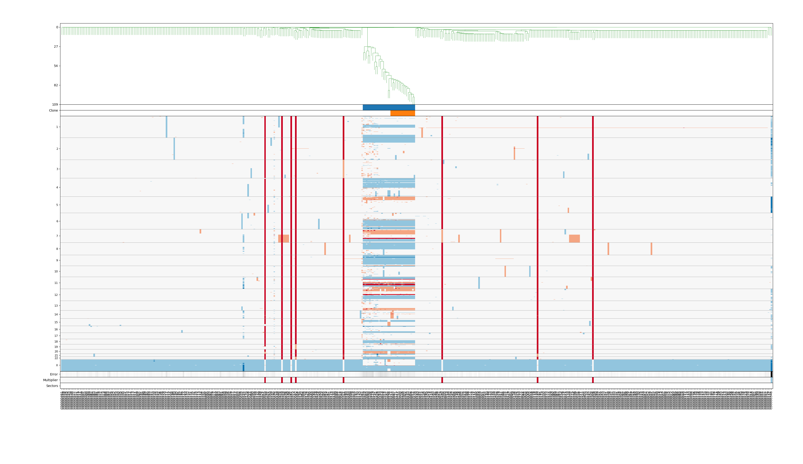

# Example usage of `sGAINS` pipeline with 10x Genomics dataset

## Create working directory

Let us start with creating a working directory where to place all data files
we plan to process with `s-GAINS` pipeline:

```
mkdir 10x-genomics
cd 10x-genomics
```

All instructions bellow asume that you are working inside this directory.


## Download example 10x Genomics dataset

In this tutorial we are going to use 
[BJ with 10% MKN-45 Spike-In](https://support.10xgenomics.com/single-cell-dna/datasets/1.1.0/bj_mkn45_10pct)
dataset that is available from 10x Genomics site. This dataset contains data from BJ Fibroblast Euploid Cell
Line with a 10% spike-in of cells from MKN-45 Gastric Cancer Cell Line MKN-45 cells. 

For processing with `s-GAINS` we are going to need following files:

* [Per-cell summary metrics](http://cf.10xgenomics.com/samples/cell-dna/1.1.0/bj_mkn45_10pct/bj_mkn45_10pct_per_cell_summary_metrics.csv)

* [Position-sorted alignments (BAM)](http://s3-us-west-2.amazonaws.com/10x.files/samples/cell-dna/1.1.0/bj_mkn45_10pct/bj_mkn45_10pct_possorted_bam.bam)

* [Position-sorted alignments index](http://cf.10xgenomics.com/samples/cell-dna/1.1.0/bj_mkn45_10pct/bj_mkn45_10pct_possorted_bam.bam.bai)

You can download these files either using your browser or using command line utility such as `wget`:

```
mkdir bj_mkn45_10pct
cd bj_mkn45_10pct
wget -c http://cf.10xgenomics.com/samples/cell-dna/1.1.0/bj_mkn45_10pct/bj_mkn45_10pct_per_cell_summary_metrics.csv
wget -c http://cf.10xgenomics.com/samples/cell-dna/1.1.0/bj_mkn45_10pct/bj_mkn45_10pct_possorted_bam.bam.bai
wget -c http://s3-us-west-2.amazonaws.com/10x.files/samples/cell-dna/1.1.0/bj_mkn45_10pct/bj_mkn45_10pct_possorted_bam.bam
cd -
```

The content of this data directory should look like:

```
bj_mkn45_10pct/
├── bj_mkn45_10pct_per_cell_summary_metrics.csv
├── bj_mkn45_10pct_possorted_bam.bam
└── bj_mkn45_10pct_possorted_bam.bam.bai
```


## Download human reference genome

* We are going to need a copy of human reference genome version `hg19`. To download
it you can go to [UCSC Genome Browser](https://genome.ucsc.edu/), locate the 
downloads section and find full data set for *GRCh37/hg19* version of human 
reference genome. 

* Download archive file `chromFa.tar.gz` and untar it into a separate directory:

    ```
    mkdir hg19_pristine
    cd hg19_pristine
    wget -c http://hgdownload.soe.ucsc.edu/goldenPath/hg19/bigZips/chromFa.tar.gz
    tar zxvf chromFa.tar.gz
    cd -
    ```

* Download `cytoBand.txt.gz` for HG19 and store it inside our working subdirectory. This
file will be needed for last step in last step of the pipeline - `scclust`.

    ```
    wget -c http://hgdownload.cse.ucsc.edu/goldenPath/hg19/database/cytoBand.txt.gz
    gunzip cytoBand.txt.gz
    mv cytoBand.txt cytoBand-hg19.txt
    ```


## `s-GAINS` configuration file

Since the pipeline has many parameters you can create a configuration file, that
sets values for most of parameters used by the pipeline.

The configuration file is in YAML format.

Let us create a `s-GAINS` configuration file named `sgains_hisat2_10x_bj_mkn45_10pct.yml`
with following content:

```yaml
aligner:
    aligner_name: hisat2

genome:
    genome_version: hg19
    genome_pristine_dir: hg19_pristine
    genome_dir: hg19
    genomeindex_prefix: genomeindex
    
mappable_regions:
    mappable_read_length: 100
    mappable_dir: hg19_R100
    mappable_file: hisat2_hg19_R100_mappable_regions.txt
    mappable_aligner_options: ""

bins:
    bins_count: 10000
    bins_dir: hg19_R100_B10k
    bins_file: hisat2_hg19_R100_B10k_bins_boundaries.txt

data_10x:
    data_10x_dir: bj_mkn45_10pct
    data_10x_prefix: "bj_mkn45_10pct"
    data_10x_cell_summary: bj_mkn45_10pct/bj_mkn45_10pct_per_cell_summary_metrics.csv
    data_10x_bam: bj_mkn45_10pct/bj_mkn45_10pct_possorted_bam.bam
    data_10x_bai: bj_mkn45_10pct/bj_mkn45_10pct_possorted_bam.bam.bai

reads:
    reads_dir: results/bj_mkn45_10pct/reads
    reads_suffix: ".fastq.gz"

mapping:
    mapping_dir: results/bj_mkn45_10pct/mapping
    mapping_suffix: ".rmdup.bam"
    mapping_aligner_options: ""

varbin:
    varbin_dir: results/bj_mkn45_10pct/varbin_10x
    varbin_suffix: ".varbin.r100_10k.txt"

scclust:
    scclust_case: "bj_mkn45_10pct"
    scclust_dir: results/bj_mkn45_10pct/scclust_10x
    scclust_cytoband_file: cytoBand-hg19.txt
    scclust_nsim: 150
    scclust_sharemin: 0.80
    scclust_fdrthres: -3
    scclust_nshare: 4
    scclust_climbtoshare: 5
```

## `s-GAINS` pipeline preparation

### Preparation of genome index

* Run `genomeindex` subcommand to copy and modify `hg19` reference genome from
your `hg19_pristine` copy into working `hg19` subdirectory:

    ```
    sgains-tools -c sgains_hisat2_10x_bj_mkn45_10pct.yml \
        genomeindex --genome-pristine-dir hg19_pristine --genome-dir hg19
    ```

* This step will use the specified aligner to produce genome index of the *hg19* 
reference genome. Building this index is computationally intensive process and
could take several hours of CPU time.


### Preparation of uniquely mappable regions

* The next step is to generate uniquely mappable regions, i.e. contiguous regions wherein 
all reads of a given length are unique in the genome. To this end you can use 
`mappalbe-regions` subcommand of `s-GAINS` pipeline. You need to specify the directory, 
where a working copy of reference genome is located and the read length to be used.

* Here is an example of invoking the `mappalbe-regions` subcommand with reads of
length 100:

    ```
    sgains-tools -c sgains_hisat2_10x_bj_mkn45_10pct.yml \
        mappable-regions --genome-dir hisat_hg19 \
        --mappable-dir hg19_R100 --mappable-read-length 100 \
        --mappable-file hisat2_hg19_R100_mappable_regions.txt
    ````

* This step is computationaly very intensive and could take days in CPU time.
Consider using `--parallel` option of `sgains-tools` command to parallelize the
computation if your computer has a suitable number of cores. For example, on a
workstation with 10 cores you could use 8 cores to compute mappable regions:

    ```
    sgains-tools -p 8 -c sgains_hisat2_10x_bj_mkn45_10pct.yml \
        mappable-regions --genome-dir hisat_hg19 \
        --mappable-dir hg19_R100 --mappable-read-length 100 \
        --mappable-file hisat2_hg19_R100_mappable_regions.txt
    ````

### Calculation of bin boundaries

In this step we will partition the genome into bins with an expected equal 
number of uniquely mappable positions.


* Run `bins` subcommand to calculate bin boundaries. To run the command you need to specify:
    * the number of bins you want to calculate
    * a directory for storing the bin boundary file
    * a directory and file name for mappable regions
    * a directory where a working copy of HG19 is located

    ```
    sgains-tools -c sgains_hisat2_10x_bj_mkn45_10pct.yml \
        bins \
        --mappable-dir hg19_R100 \
        --mappable-file hisat2_hg19_R100_mappable_regions.txt \
        --genome-dir hg19 \
        --bins-count 0000 \
        --bins-dir hg19_R100_B10k \
        --bins-file hisat2_hg19_R100_B10k_bins_boundaries.txt
    ```


## Processing data with `s-GAINS` pipeline

### `extract-10x` step

10x Genomics Cell Ranger processing pipeline uses a 
[Burrow-Wheeler Aligner](https://github.com/lh3/bwa). At the moment `s-GAINS` does not
support `bwa` aligner, so the recommended way to process 10x-Genomics datasets is to
re-align the dataset using `s-GAINS`.

To this end we first extract fastq reads from
the dataset using `extract-10x` subcommand:

```
    sgains-tools -c sgains_hisat2_10x_bj_mkn45_10pct.yml -p 8 \
        extract-10x \
        --data-10x-dir bj_mkn45_10pct \
        --data-10x-prefix bj_mkn45_10pct \
        --data-10x-cell-summary bj_mkn45_10pct/bj_mkn45_10pct_per_cell_summary_metrics.csv \
        --data-10x-bam bj_mkn45_10pct/bj_mkn45_10pct_possorted_bam.bam \
        --data-10x-bai bj_mkn45_10pct/bj_mkn45_10pct_possorted_bam.bam.bai \
        --reads-dir results/bj_mkn45_10pct/reads \
        --reads-suffix .fastq.gz
```

Alternatively we can rely on our configuration file and use:

```
    sgains-tools -c sgains_hisat2_10x_bj_mkn45_10pct.yml -p 8 extract-10x
```

Values for all required parameters will be supplied by the configuration file 
`sgains_hisat2_10x_bj_mkn45_10pct.yml`.

### `mapping` step

When we have the reads we can go to the mapping step. By default `sgains-tools` uses unique 
mapping of reads, i.e. if the read could be mapped on more than one place on reference genome
it will be discarded.

This step is CPU intensive and could take hours in CPU time.

To start the mapping step you can use:

```
sgains-tools -p 8 -c sgains_hisat2_10x_bj_mkn45_10pct.yml mapping
```

Please note that `-p 8` in the previous command starts 8 processes for
aligning samples on the reference genome. You need to adapt this number depending
on the hardware resources you have in your hands.


### `varbin` step

The `varbin` step counts the number of reads aligned in each uniquely mappable
region of reference genome. For each uniquely mapped read we take the starting 
position of the read, find the bin in which it is contained and increment the read
count for this bin.

To start this step you should use:

```
sgains-tools -p 8 -c sgains_hisat2_10x_bj_mkn45_10pct.yml varbin
```

### `scclust` step

This step performs segmentation and clustering of the read counts using `SCclust`
package and prepares the results, that could be visualized using `SCGV` viewer.

To run the step you could use:

```
sgains-tools -c sgains_hisat2_10x_bj_mkn45_10pct.yml scclust
```

This command will read the results from `varbin` step and will store results
in subdirectory as configured in `sgains_hisat2_10x_bj_mkn45_10pct.yml` configuration file.


## Visualization of results

You can visualize results from segmentation and clustering using 
[`SCGV` viewer](https://github.com/KrasnitzLab/SCGV).




