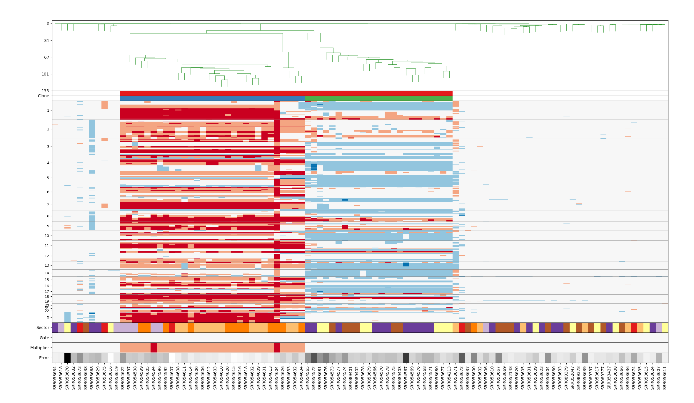

# Example usage of `sGAINS` pipeline


The `s-GAINS` pipeline has two groups of steps:

* **prepare** that prepares the binning scheme used for further analysis and
* **process** that does the actual analysis of the experimental data.


## Download data for polygenomic breast tumor T10

In this tutorial we will use data from the paper:

[Navin N, Kendall J, Troge J, et al. Tumor Evolution Inferred by Single 
Cell Sequencing. 
Nature. 2011;472(7341):90-94. doi:10.1038/nature09807.](https://www.ncbi.nlm.nih.gov/pmc/articles/PMC4504184/)

In particular we will use the data for polygenomic breast tumor T10 case available from SRA.

Description of samples for T10 could be found in
[Supplementary Table 1 | Summary of 100 Single Cells in the Polygenomic Tumor 
T10](https://www.ncbi.nlm.nih.gov/pmc/articles/PMC4504184/bin/NIHMS706545-supplement-Supplement_Table_1.xls)


Let us create a directory `navinT10` where all the data, configuration and results 
from running the pipeline will be stored:

```
mkdir navinT10
cd navinT10
```
* Create a subdirectory `SRA` for storing the downloaded read file:

    ```
    mkdir SRA
    cd SRA
    ```

* Go to [https://www.ncbi.nlm.nih.gov/Traces/study/?acc=SAMN00014736](https://www.ncbi.nlm.nih.gov/Traces/study/?acc=SAMN00014736) 
and use *Accession List* button to download file `SRR_Acc_List.txt` containing
all samples accession numbers for this experiment. The downloaded `SRR_Acc_List.txt`
should contain SRA identifiers for 100 samples:

    ```
    head SRR_Acc_List.txt 
    SRR052047
    SRR052148
    SRR053437
    SRR053600
    SRR053602
    SRR053604
    SRR053605
    SRR053606
    SRR053607
    SRR053608
    ```

* To download the sample reads you need to use *SRA Toolkit*. SRA Toolkit is
available in Anaconda `bioconda` channel. You can install it using your Anaconda 
`sgains` environment:

    ```
    conda install sra-tools
    ```


* To download read files for T10 Ductal Carcinoma you can use `fastq-tool`. If
you need a read file for a single sample, you can use:

    ```
    fastq-dump --gzip SRR089402
    ```
This command will download a read file in `fastq` format for a sample with 
accession number *SRR089402*. 

* If you want to download read files for all samples from accession list 
`SRR_Acc_List.txt`, you can use (**please note that the this command will download 
about 50Gb of data and will store about 100Gb of data on disk - cache and actual 
reads**):

    ```
    cat SRR_Acc_List.txt | xargs fastq-dump --gzip
    ```


## PREPARE: `s-GAINS` pipeline prepration

Create a directory where to place all data files you plan to process with 
`s-GAINS` pipeline:

```
mkdir data
cd data
```

All instructions bellow asume that you are working inside your data directory.

### Preparation of genome index

* First you need a copy of human reference genome version `hg19`. To download
it you can go to [UCSC Genome Browser](https://genome.ucsc.edu/), locate the 
downloads section and find full data set for *GRCh37/hg19* version of human 
reference genome. 

* Download archive file `chromFa.tar.gz` and untar it into a separate directory:

    ```
    mkdir hg19_pristine
    cd hg19_pristine
    wget -c http://hgdownload.soe.ucsc.edu/goldenPath/hg19/bigZips/chromFa.tar.gz
    tar zxvf chromFa.tar.gz
    ```
* Go back to the data directory and create a `hg19` subdirectory where the 
pipeline will place a modified version of `hg19` reference genome:

    ```
    mkdir hg19
    ```

* Run `genomeindex` subcommand to copy and modify `hg19` reference genome from
your `hg19_pristine` copy into working `hg19` subdirectory:

    ```
    sgains.py genomeindex --genome-pristine hg19_pristine --genome-dir hg19
    ```

* This step will use `bowtie-build` command to produce bowtie index of the *hg19* 
reference genome. Building this index is computationally intensive process and
could take several hours of CPU time.

* Download `cytoBand.txt` for HG19 and store it inside `hg19` subdirectory. This
file will be needed for last step in last step of the pipeline - `scclust`.

```
cd hg19
wget -c http://hgdownload.cse.ucsc.edu/goldenPath/hg19/database/cytoBand.txt.gz
gunzip cytoBand.txt.gz
```


### Preparation of uniquely mappable regions

* The next step is to generate uniquely mappable regions, i.e. contiguous regions wherein 
all reads of a given length are unique in the genome. To this end you can use 
`mappalbe-regions` subcommand of `s-GAINS` pipeline. You need to specify the directory, 
where a working copy of reference genome is located and the read length to be used.

* Create a subdirectory in which to save mappable regions file:

    ```
    mkdir R50
    ```

* Here is an example of invoking the `mappalbe-regions` subcommand with reads of
length 100:

    ```
    sgains.py mappable-regions --genome-dir hg19 \
        --mappable-dir R50 --read-length 50
    ````

* This step is computationaly very intensive and could take days in CPU time.
Consider using `--parallel` option of `sgains.py` command to parallelize the
computation if your computer has a suitable number of cores. For example, on a
workstation with 10 cores you could use 8 cores to compute mappable regions:
    ```
    sgains.py -p 8 mappable-regions --genome-dir hg19 \
        --mappable-dir R50 --read-length 50
    ```

* Alternatively you can download precomputed mappable regions file from `s-GAINS`
pipeline releases at [https://github.com/KrasnitzLab/sgains/releases](https://github.com/KrasnitzLab/sgains/releases). 
For this tutorial you should download mappable regions with length 50 base pairs for HG19
reference genome from [https://github.com/KrasnitzLab/sgains/releases/download/1.0.0RC1/hg19_R50_mappable_regions.txt.gz](https://github.com/KrasnitzLab/sgains/releases/download/1.0.0RC1/hg19_R50_mappable_regions.txt.gz).

    ```
    mkdir R50
    cd R50/
    wget -c https://github.com/KrasnitzLab/sgains/releases/download/1.0.0RC1/hg19_R50_mappable_regions.txt.gz
    gunzip hg19_R50_mappable_regions.txt.gz
    ```

### Calculation of bins boundaries

* Create a subdirectory for storing the bin boundaries file:

    ```
    mkdir R50_B20k
    ```

* Run `bins` subcommand to calculate bin boundaries. To run the command you need to specify:
    * the number of bins you want to calculate
    * a directory for storing the bin boundary file
    * a directory and file name for mappble regions
    * a directory where a working copy of HG19 is located

    ```
    sgains.py bins \
        --mappable-dir R50 \
        --mappable-regions hg19_R50_mappable_regions.txt \
        --genome-dir hg19 \
        --bins-count 20000 \
        --bins-dir R50_B20k \
        --bins-boundaries hg19_R50_B20k_bins_boundaries.txt
    ```
* Alternatively you can download bins boundaries file from `s-GAINS` pipeline
releases at [https://github.com/KrasnitzLab/sgains/releases](https://github.com/KrasnitzLab/sgains/releases).
For this tutorial you should download bins boundaries file for 20000 bins with read
length 50bp for HG19 reference genome from 
[https://github.com/KrasnitzLab/sgains/releases/download/1.0.0RC1/hg19_R50_B20k_bins_boundaries.txt.gz](https://github.com/KrasnitzLab/sgains/releases/download/1.0.0RC1/hg19_R50_B20k_bins_boundaries.txt.gz)


    ```
    mkdir R50_B20k
    cd R50_B20k/
    wget -c https://github.com/KrasnitzLab/sgains/releases/download/1.0.0RC1/hg19_R50_B20k_bins_boundaries.txt.gz
    gunzip hg19_R50_B20k_bins_boundaries.txt.gz
    ```


## Configure the pipeline

Since the pipeline has many parameters you can create a configuration file, that
sets values for most of parameters used by the pipeline.

The configuration file is in YAML format and has the following structure:

```
genome:
    version: hg19
    data_dir: hg19_pristine
    work_dir: hg19
    genome_index: genomeindex

mappable_regions:
    length: 50
    work_dir: R50
    bowtie_opts: ""
  
bins:
    bins_count: 20000
    bins_dir: R50_B20k
    bins_boundaries: hg19_R50_B20k_bins_boundaries.txt

mapping:
    reads_dir: SRA
    reads_suffix: ".fastq.gz"
    mapping_dir: mapping
    mapping_suffix: ".rmdup.bam"
    mapping_bowtie_opts: "-S -t -m 1 --best --strata --chunkmbs 256"

varbin:
    varbin_dir: varbin
    varbin_suffix: ".varbin.20k.txt"

scclust:
    case_name: "navin_T10"
    scclust_dir: scclust
    cytoband: hg19/cytoBand.txt
    nsim: 150
    sharemin: 0.85

```

Store this file as `sgains.yml` that is the default configuration file for
`s-GAINS` pipeline. For this tutorail the configuration file should be stored 
inside `navinT10` working directory.


## Processing data with `s-GAINS` pipeline

To demonstrate the usage of `s-GAINS` pipeline we are going to use data from

[Navin N, Kendall J, Troge J, et al. Tumor Evolution Inferred by Single 
Cell Sequencing. 
Nature. 2011;472(7341):90-94. doi:10.1038/nature09807.](https://www.ncbi.nlm.nih.gov/pmc/articles/PMC4504184/)


### Process downloaded data

Once we have `s-GAINS` configuration file setup we can run `sgains.py` command
to process the downloaded data (**please note that this command in computationally 
intensive and could take long time to finish**):

    ```
    sgains.py -p 10 process -o T10_Results
    ```

This command will run the last three steps of the pipeline:

* `mapping` step that maps reads to uniquely mappable regions produced in step
`mappable_regions`

* `varbin` step that transforms the mappings into bin counts for the binning
scheme we have produced in step `bins`

* `scclust` step that segments the bins counts and builds the
clonal structure of the samples using hierarchical clustering.


Each of these steps has its own subcommand and you can run the steps individually.
For example to run the `mapping` step you can use:

```
sgains.py -p 10 mapping
```

The result from `process` is written in directory passed to `-o` option of 
the command. Inside `T10_Results` directory the `sgains.py` will create
named after the `case_name` with subdirectories for the results of each of the
steps of `process` command:

```
.
└── navin_T10
    ├── mapping
    ├── scclust
    └── varbin
```

You can visualize results from segmentation and clustering using `SCGV` viewer.



