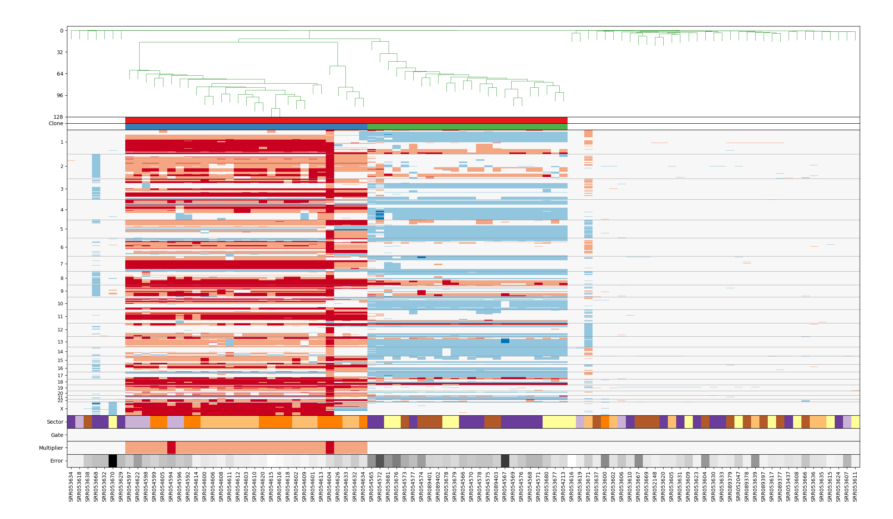

# Example usage of `sGAINS` pipeline


The `s-GAINS` pipeline has two major groups of commands:

* **prepare** that prepares the binning scheme used for further analysis and
* **process** that does the actual analysis of the experimental data.

We are going to start with `s-GAINS` pipeline preparation,  then we are going to
download the data we want to analyse and as a last step we will show the actual
analysis of the downloaded data.

## Create working directory

Create a directory where to place all data files you plan to process with 
`s-GAINS` pipeline:

```
mkdir sgains_data
cd sgains_data
```

All instructions bellow asume that you are working inside your data directory.


## Download data for the T10 case

In this tutorial we will use data from the paper:

[Navin N, Kendall J, Troge J, et al. Tumor Evolution Inferred by Single 
Cell Sequencing. 
Nature. 2011;472(7341):90-94. doi:10.1038/nature09807.](https://www.ncbi.nlm.nih.gov/pmc/articles/PMC4504184/)

In particular we will use the data for polygenomic breast tumor T10 case available from SRA.

Description of samples for T10 could be found in
[Supplementary Table 1 | Summary of 100 Single Cells in the Polygenomic Tumor 
T10](https://www.ncbi.nlm.nih.gov/pmc/articles/PMC4504184/bin/NIHMS706545-supplement-Supplement_Table_1.xls)

* Create a subdirectory `SRA` for storing the downloaded read file:

    ```
    mkdir navin_T10
    cd navin_T10
    ```

* Download the list of SRA indentifiers of the samples T10 samples from:
[navin_T10_list.csv](https://raw.githubusercontent.com/KrasnitzLab/sgains/master/docs/navin_T10_list.csv).
The downloaded file should look like this:
    ```
    head navin_T10_list.csv 
    SRR053668
    SRR053669
    SRR053670
    SRR053671
    SRR052047
    ...
    ```
    Please note that this list contains only 95 samples (out of 100 published in
    the paper). We have reduced the number of samples used because we do not know
    the correspondence between SRA identifiers and identifiers used in the paper for
    five of the samples. These are the following samples:
    ```
    SRR053672
    SRR053673
    SRR053674
    SRR053675
    SRR054607
    ```
    If you want to work with full set of SRA samples
    go to [https://www.ncbi.nlm.nih.gov/Traces/study/?acc=SAMN00014736](https://www.ncbi.nlm.nih.gov/Traces/study/?acc=SAMN00014736) 
    and use *Accession List* button to download file `SRR_Acc_List.txt` containing
    all samples accession numbers for this experiment. The downloaded `SRR_Acc_List.txt`
    should contain SRA identifiers for 100 samples:
    ```
    head SRR_Acc_List.txt 
    SRR052047
    SRR052148
    SRR053437
    SRR053600
    SRR053602
    ...
    ```

* To download the sample reads you need to use *SRA Toolkit*. SRA Toolkit is
available in Anaconda `bioconda` channel. You can install it using your Anaconda 
`sgains` environment:

    ```
    conda install sra-tools
    ```


* To download read files for T10 Ductal Carcinoma you can use `fastq-tool`. If
you need a read file for a single sample, you can use:
    ```
    fastq-dump --gzip SRR053668
    ```
    This command will download a read file in `fastq` format for sample with 
    accession number *SRR053668*. 

* If you want to download read files for all samples from 
`navin_T10_list.csv`, you can use (**please note that the this command will download 
about 50Gb of data and will store about 100Gb of data on disk - cache and actual 
reads**):

    ```
    cat navin_T10_list.csv | xargs fastq-dump --gzip
    ```

## `s-GAINS` configuration file

Since the pipeline has many parameters you can create a configuration file, that
sets values for most of parameters used by the pipeline.

The configuration file is in YAML format.

Let us create a `s-GAINS` configuration file named `sgains-hisat2-hg19-navin-T10.yml`
with following content:

```yaml
aligner:
    aligner_name: hisat2

genome:
    genome_version: hg19
    genome_pristine_dir: hg19_pristine
    genome_dir: hisat2_hg19
    genomeindex_prefix: genomeindex

mappable_regions:
    mappable_read_length: 50
    mappable_dir: hisat2_hg19_R50
    mappable_file: hisat2_hg19_R50_mappable_regions.txt
    mappable_aligner_options: ""
  
bins:
    bins_count: 20000
    bins_dir: hisat2_hg19_R50_B20k
    bins_file: hg19_R50_B20k_bins_boundaries.txt

reads:
    reads_dir: navin_T10
    reads_suffix: ".fastq.gz"
    

mapping:
    mapping_dir: navin_T10_hisat2_hg19/mapping
    mapping_suffix: ".rmdup.bam"
    mapping_aligner_options: "-3 0 -5 38"

varbin:
    varbin_dir: navin_T10_hisat2_hg19/varbin
    varbin_suffix: ".varbin.r50_20k.txt"


scclust:
    scclust_case: "nyu007_hisat2"
    scclust_dir: "navin_T10_hisat2_hg19/scclust"
    scclust_cytoband_file: cytoBand-hg19.txt
    scclust_nsim: 150
    scclust_sharemin: 0.85
    scclust_fdrthres: -3
    scclust_nshare: 4
    scclust_climbtoshare: 5
```

## PREPARE: `s-GAINS` pipeline preparation

### Preparation of genome index

* First you need a copy of human reference genome version `hg19`. To download
it you can go to [UCSC Genome Browser](https://genome.ucsc.edu/), locate the 
downloads section and find full data set for *GRCh37/hg19* version of human 
reference genome. 

* Download archive file `chromFa.tar.gz` and untar it into a separate directory:

    ```
    mkdir hg19_pristine
    cd hg19_pristine
    wget -c http://hgdownload.soe.ucsc.edu/goldenPath/hg19/bigZips/chromFa.tar.gz
    tar zxvf chromFa.tar.gz
    ```
* Go back to the data directory and create a `hg19` subdirectory where the 
pipeline will place a modified version of `hg19` reference genome:

    ```
    mkdir hg19
    ```

* Run `genomeindex` subcommand to copy and modify `hg19` reference genome from
your `hg19_pristine` copy into working `hisat2_hg19` subdirectory:

    ```
    sgains-tools -c sgains-hisat2-hg19-navin-T10.yml \
        genomeindex --genome-pristine hg19_pristine --genome-dir hisat2_hg19
    ```

* This step will use the specified aligner to produce genome index of the *hg19* 
reference genome. Building this index is computationally intensive process and
could take several hours of CPU time.

* Download `cytoBand.txt.gz` for HG19 and store it inside our working subdirectory. This
file will be needed for last step in last step of the pipeline - `scclust`.

    ```
    cd hg19
    wget -c http://hgdownload.cse.ucsc.edu/goldenPath/hg19/database/cytoBand.txt.gz
    gunzip cytoBand.txt.gz
    mv cytoBand.txt cytoBand-hg19.txt
    ```


### Preparation of uniquely mappable regions

* The next step is to generate uniquely mappable regions, i.e. contiguous regions wherein 
all reads of a given length are unique in the genome. To this end you can use 
`mappalbe-regions` subcommand of `s-GAINS` pipeline. You need to specify the directory, 
where a working copy of reference genome is located and the read length to be used.

* Create a subdirectory in which to save mappable regions file:

    ```
    mkdir R50
    ```

* Here is an example of invoking the `mappalbe-regions` subcommand with reads of
length 100:

    ```
    sgains-tools -c sgains-hisat2-hg19-navin-T10.yml \
        mappable-regions --genome-dir hisat_hg19 \
        --mappable-dir hisat2_hg19_R50 --mappable-read-length 50
    ````

* This step is computationaly very intensive and could take days in CPU time.
Consider using `--parallel` option of `sgains-tools` command to parallelize the
computation if your computer has a suitable number of cores. For example, on a
workstation with 10 cores you could use 8 cores to compute mappable regions:
    ```
    sgains-tools -p 8 -c sgains-hisat2-hg19-navin-T10.yml \
        mappable-regions --genome-dir hisat2_hg19 \
        --mappable-dir hisat2_hg19_R50 --mappable-read-length 50
    ```

* Alternatively you can download precomputed mappable regions file from `s-GAINS`
pipeline releases at [https://github.com/KrasnitzLab/sgains/releases](https://github.com/KrasnitzLab/sgains/releases). 
For this tutorial you should download mappable regions with length 50 base pairs for HG19
reference genome from [https://github.com/KrasnitzLab/sgains/releases/download/1.0.0RC1/hg19_R50_mappable_regions.txt.gz](https://github.com/KrasnitzLab/sgains/releases/download/1.0.0RC1/hg19_R50_mappable_regions.txt.gz).

    ```
    mkdir R50
    cd R50/
    wget -c https://github.com/KrasnitzLab/sgains/releases/download/1.0.0RC1/hg19_R50_mappable_regions.txt.gz
    gunzip hg19_R50_mappable_regions.txt.gz
    ```

### Calculation of bin boundaries

In this step we will partition the genome into bins with an expected equal 
number of uniquely mappable positions.

* Create a subdirectory for storing the bin boundaries file:

    ```
    mkdir hisat2_hg19_R50_B20k
    ```

* Run `bins` subcommand to calculate bin boundaries. To run the command you need to specify:
    * the number of bins you want to calculate
    * a directory for storing the bin boundary file
    * a directory and file name for mappable regions
    * a directory where a working copy of HG19 is located

    ```
    sgains-tools -c sgains-hisat2-hg19-navin-T10.yml bins \
        --mappable-dir hisat2_hg19_R50 \
        --mappable-file hisat_hg19_R50_mappable_regions.txt \
        --genome-dir hisat2_hg19 \
        --bins-count 20000 \
        --bins-dir hisat2_hg19_R50_B20k \
        --bins-file hisat2_hg19_R50_B20k_bins_boundaries.txt
    ```
* Alternatively you can download bin boundaries file from `s-GAINS` pipeline
releases at [https://github.com/KrasnitzLab/sgains/releases](https://github.com/KrasnitzLab/sgains/releases).
For this tutorial you should download bin boundaries file for 20000 bins with read
length 50bp for HG19 reference genome from 
[https://github.com/KrasnitzLab/sgains/releases/download/1.0.0RC1/hg19_R50_B20k_bins_boundaries.txt.gz](https://github.com/KrasnitzLab/sgains/releases/download/1.0.0RC1/hg19_R50_B20k_bins_boundaries.txt.gz)


    ```
    mkdir R50_B20k
    cd R50_B20k/
    wget -c https://github.com/KrasnitzLab/sgains/releases/download/1.0.0RC1/hg19_R50_B20k_bins_boundaries.txt.gz
    gunzip hg19_R50_B20k_bins_boundaries.txt.gz
    ```


## PROCESS: Processing data with `s-GAINS` pipeline


### Process downloaded data


#### `mapping` step

First step in processing samples is to map them on the reference genome. For the
mapping we are using `bowtie`. By default `sgains-tools` uses unique mapping of reads, 
i.e. if the read could be mapped on more than one place on reference genome it 
is discarded.

This step is CPU intensive and could take hours in CPU time.

To start the mapping step you can use:

```
sgains-tools -p 8 -c sgains-hisat2-hg19-navin-T10.yml mapping
```

Please note that `-p 8` in the previous command starts 8 `bowtie` processes for
aligning samples on the reference genome. You need to adapt this number depending
on the hardware resources you have in your hands.


#### `varbin` step

The `varbin` step counts the number of reads aligned in each uniquely mappable
region of reference genome. For each uniquely mapped read we take the starting 
position of the read, find the bin in which it is contained and increment the read
count for this bin.

To start this step you should use:

```
sgains-tools -p 8 sgains-hisat2-hg19-navin-T10.yml varbin
```

#### `scclust` step

This step performs segmentation and clustering of the read counts using `SCclust`
package and prepares the results, that could be visualized using `SCGV` viewer.

To run the step you could use:

```
sgains-tools sgains-hisat2-hg19-navin-T10.yml scslust
```

This command will read the results from `varbin` step and will store results
in subdirectory as configured in `sgains.yml` configuration file.


#### Run whole processing pipeline in single command
Once we have `s-GAINS` configuration file setup we can run `sgains-tools` command
to process the downloaded data (**please note that this command in computationally 
intensive and could take long time to finish**):

    ```
    sgains-tools -p 10 -c sgains-hisat2-hg19-navin-T10.yml process
    ```

This command will run the last three steps of the pipeline:

* `mapping` step that maps reads to the reference genome

* `varbin` step that transforms the mappings into bin counts for the binning
scheme we have produced in step `bins`

* `scclust` step that segments the bins counts and builds the
clonal structure of the samples using hierarchical clustering.

The results from running this command will be stored as configured in the
configuration file or could be overridden using CLI parameters.

#### Visualization of results

You can visualize results from segmentation and clustering using 
[`SCGV` viewer](https://github.com/KrasnitzLab/SCGV).




